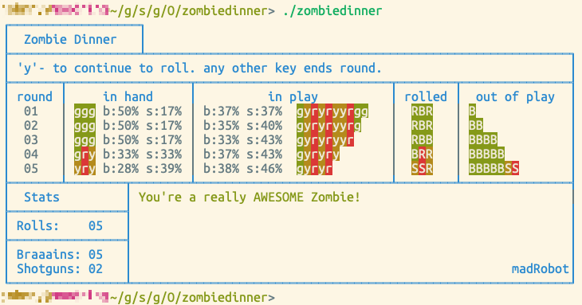

zombiedinner
============

zombie dinner - programming experience - golang style.
-----------------------------------------------------

Look! You didn't want to hear this I know, but you are a ZOMBIE!

And I know that you really don't want to hear that you love to eat BRAINS!

Did I mention that there are 'others' who just want to deprive you of
your natural ambitions? FYI - They will shoot you with their 'Big Bang' sticks!

Well, good luck. 

_Zombie Dinner_ 
A digital take on the famous 'Zombie Dice' created by Steve Jackson.
A game where you pull three dice from your plate/cup..
roll them and hope for the best!
Each die-face can be either
* _Brains_   - Oooh! You caught that huumon. Put it on the dinner plate and eat it!
* _Runaways_ - That huumon ran away from you (just a poor hungry zombie).
* _Shot_     - OUCH! You hate those 'BIG BANG Sticks'. I'm not the monster.. they are!

(You can probably figure out the rules.. we all know you have played Zombie Dice before!)

Zombie Dinner  takes simple input.
After each roll.. you will need to type a 'y' to continue to roll,
or any other key to quit the round.
Game scoring is done the 'good ol fashion way' w/pen and paper.
  pencils are accepted as well, but we all know the ol' wives tale
  about pencils and zombies.. heh heh heh.
  Oh, you don't know the ol' wives tale about pencils and zombies?
  well actually, neither do I.. but I interpreted via a TikTok video
  that it has something to do with pencils causing irritations in 
  zombie nasal cavities.  Don't believe me.. just Zoogle it.

Plenty of stats are given to help your average zombie make intelligent decisions.
NOTE: Programming zombies to have intelligence was a monumental undertaking.  (your welcome / or not).

_WARNING:_
Do not use _Zombie Dinner_ in the event of a real zombie apocalypse!

**Requirements**
Please read the *INSTALL.MD* file for the requirements and info on how to get started with GO.

